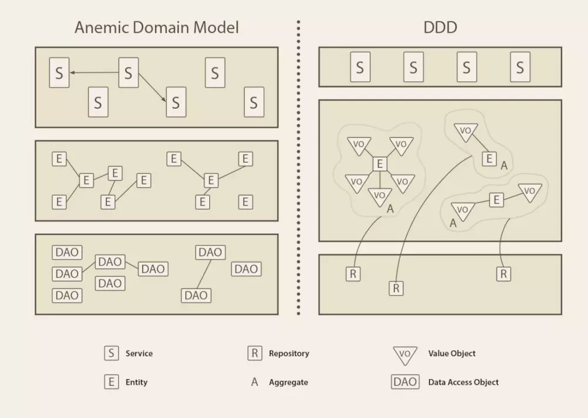
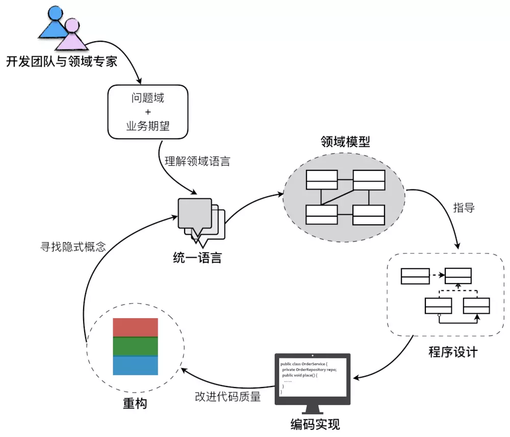
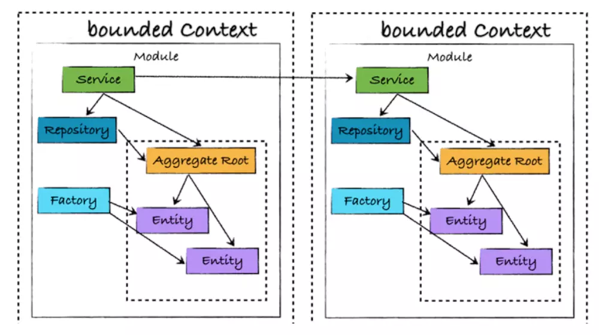
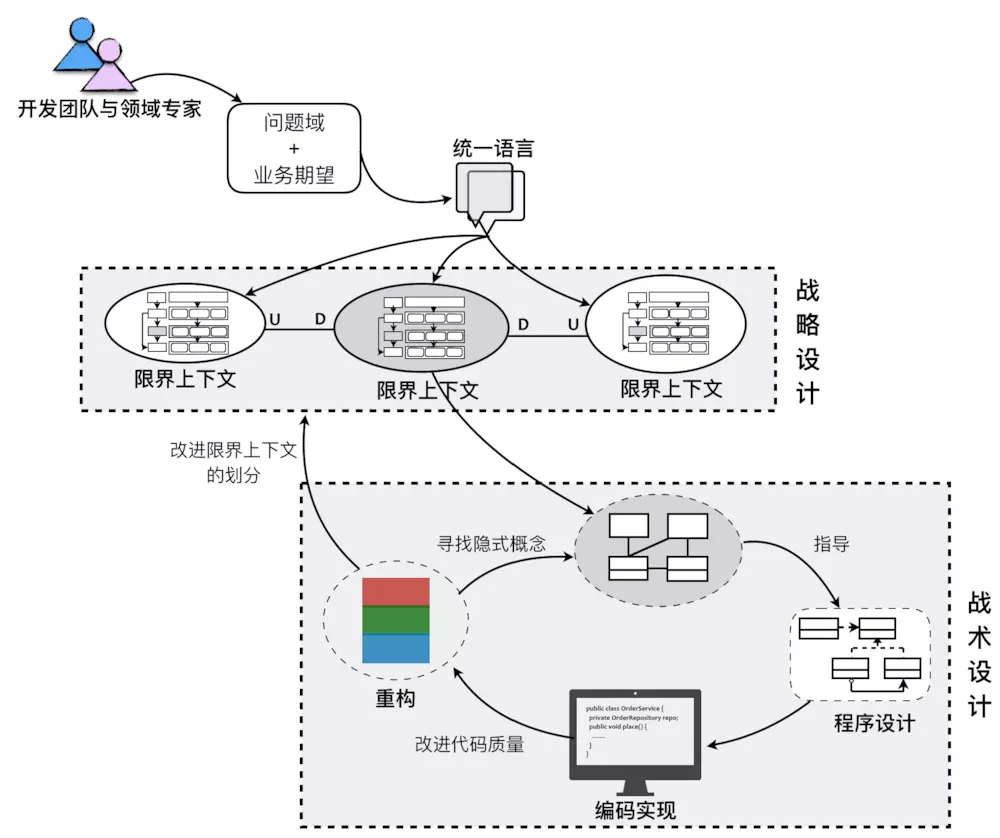

# 一、CRUD 的各种问题
数据库就像是现代软件开发的一剂灵丹妙药，不仅提供可靠、快速、大容量的存储服务，还支持强大的事务管理机制，满足了大部分场景中对数据的一致性需求。数据库如此的强大，以至于我们从接触软件开发开始就一直使用「CRUD」的模式进行开发。我们的「潜意识」中就形成了「以数据为中心」的开发模式。

## 问题一：面向对象和数据库天然阻抗

* **对象和关系数据库累赘转换** - 在一个面向对象的系统中，对象是数据的承载方式，每一个 DAO 对象都对应着关系数据库中的一条数据。但通常视图层只显示完整实体对象的一小部分数据，在绝大多数应用中，通过创建一个新的专用的「数据传输对象」来承载视图层所需数据。于是我们看到各种冗余、繁多的「传输层对象」，随着时间的推移，系统中堆积的「传输层对象」越来越多，不仅增加了系统的「复杂度」，而且还降低了我们的「开发效率」。

* **继承关系的尴尬实现** - 继承是面向对象的一个重要特性，而关系数据库却难以复现对象世界中的继承关系。

* **类的复杂关系实现** - 使用外键、主键或使用一个中间关系表来表达关系。

## 问题二：是一种数据模型，与业务脱节

「Entity层」只是数据库表结构的一种映射用于承载数据；「DAO层」只是封装了对「Entity层」的增删改查；「Controller层」只是简单的把地址和对应「Service层」的对应方法做了关联返回结果给「视图层」；而「Service层」则大部分工作也只是在做一些「查询」、「拼接数据」的工作。这样的系统是声称套上了业务的外衣，而实则几乎无法保证业务逻辑的正确性、完整性。

## 问题三：CRUD 缺少意图

当系统的「复杂度」上升的时候，「CRUD」可能会缺少一件事：意图。例如：

我们想要改变一个 Customer 的地址，在「CRUD」体系中，我们只需要发出更新语句就能实现。但是我们无法弄清楚这种变化是由不正确的操作引起的，还是客户真的转移到了另一个城市。也许我们有一个业务场景，需要再重新定位时触发对外部系统的通知。在这种情况下，「CRUD」显得有所缺失。

## 问题四：被人诟病的「U」

并且现在由于「REST」的流行，大多数的「API」都是围绕「资源模型」来进行「CRUD」操作的，这样做不仅确实极大地方便了开发人员的工作，并且借由「HTTP动词」和「资源URI」结合起来有很好的可读性。

然而，我们考虑一个简单的「银行账户」资源的问题。当我们需要把账户的余额更新为想要的数量的时候，我们应该允许客户端直接调用更新方法吗？任何余额调整的动作都应该作为某种类型的交易事务被记录下来才对，例如「充值」、「取钱」，还是「转账」？另外账户是否存在？可能变更吗？等等一系列问题都可能使你的通用「U」变得臃肿难以维护。

## 问题五：提供变更历史记录的操作很复杂

「CRUD」会丢失应用程序的历史记录。例如，如果用户在一段时间内多次变更记录，我们则无法再跟踪单个更改。更糟糕的是，甚至无法确定该条目是否曾经被改变过。

当然，这可以通过为最后更新的时间戳添加字段来处理，但这只会帮助我们能够获得最新的更新。如果你对整个历史感兴趣，事情就会变得复杂：你必须从一开始就额外引入一组字段or一张新表。

这里的问题是：由于你不知道将来会询问哪些关于你数据的问题，因此你无法针对相应的情况对表做出优化。因为你收集太多或者太少的数据，似乎都存在一定问题。

## 小结

理解并抽象出业务逻辑，建立满足需求的业务模型，以此设计实现出可靠的系统，并有效地控制复杂性。

爱因斯坦说：“如果给我 1 个小时解答一道决定我生死的问题，我会花 55 分钟来弄清楚这道题到底是在问什么。一旦清楚了它到底在问什么，剩下的 5 分钟足够回答这个问题。”

# 二、DDD

「DDD」的全称是「Domain-driven Design」，即「领域驱动设计」。是由「Eric Evans」最早提出的综合软件系统分析和设计的面向对象建模方法，如今已经发展为一种针对大型复杂系统的领域建模与分析方法。

「DDD」定义了一些基本概念，然后尝试让业务和开发都能够理解这些概念名词，然后让「领域专家」（这里你可以理解为熟悉业务的人）使用这些概念名词来描述业务，而由于使用了规定的概念名词，开发就可以很好的理解领域业务，并能够按照领域业务设计的方式进行软件实现。

**<u>这就是DDD的初衷：让业务架构绑定系统架构</u>**。

    
     
    业务架构绑定系统架构

## DDD 帮助解决微服务拆分困境

使用DDD可以做到绑定业务架构和系统架构，这种绑定对于微服务来说有什么关系呢。所谓的微服务拆分困难，其实根本原因是不知道边界在什么地方。而使用DDD对业务分析的时候，首先会使用「聚合」这个概念把关联性强的业务概念划分在一个边界下，并限定「聚合」和「聚合」之间只能通过「聚合根」来访问，这是第一层边界。

然后在「聚合」基础之上根据「业务相关性」、「业务变化频率」、「组织结构」等等约束条件来定义「限界上下文」，这是第二层边界。有了这两层边界作为约束和限制，微服务的边界也就清晰了，拆分微服务也就不再困难了。

## DDD 帮助应对系统复杂性

解决复杂和大规模软件的武器可以被粗略地归为三类：「抽象」、「分治」和「知识」。

**分治：** 把问题空间分割为规模更小且易于处理的若干子问题。分割后的问题需要足够小，以便一个人单枪匹马就能够解决他们；其次，必须考虑如何将分割后的各个部分装配为整体。分割得越合理越易于理解，在装配成整体时，所需跟踪的细节也就越少。即更容易设计各部分的协作方式。评判什么是分治得好，即高内聚低耦合。

**抽象：** 使用抽象能够精简问题空间，而且问题越小越容易理解。举个例子，从北京到上海出差，可以先理解为使用交通工具前往，但不需要一开始就想清楚到底是高铁还是飞机，以及乘坐它们需要注意什么。

**知识：** 顾名思义，「DDD」可以认为是知识的一种。

「DDD」提供了这样的知识手段，让我们知道如何抽象出「限界上下文」以及如何去「分治」。

    
     
    限界上下文与分治

另外，「DDD」架构区别于传统的方式：

    
     
    传统架构 vs. DDD

DDD」把大多数的业务逻辑都包含在了「聚合」、「实体」、「值对象」里面，简单理解也就是实现了对象自治，把之前暴露出来的一些业务操作隐藏进了「域」之中。每个不同的区域之间只能通过对外暴露的统一的聚合根来访问，这样就做了收权的操作，这样数据的定义和更改的地方就聚集在了一处，很好的解决了复杂度的问题。

# 三、领域驱动设计过程

领域驱动设计强调领域模型的重要性，并通过模型驱动设计来保障领域模型与程序设计的一致。从业务需求中提炼出统一语言（Ubiquitous Language），再基于统一语言建立领域模型；这个领域模型会指导着程序设计以及编码实现；最后，又通过重构来发现隐式概念，并运用设计模式改进设计与开发质量。这个过程如下图所示：

    
     
    领域驱动设计过程

这个过程是一个覆盖软件全生命周期的设计闭环，每个环节的输出都可以作为下一个环节的输入，而在其中扮演重要指导作用的则是“领域模型”。这个设计闭环是一个螺旋上升的迭代设计过程，领域模型会在这个迭代过程中逐渐演进，在保证模型完整性与正确性的同时，具有新鲜的活力，使得领域模型能够始终如一的贯穿领域驱动设计过程，阐释着领域逻辑，指导着程序设计，验证着编码质量。

针对问题域和业务期望提炼统一语言，并通过统一语言进行领域建模时，可能会面临高复杂度的挑战。这是因为对于一个复杂的软件系统而言，我们要处理的问题域实在太庞大了。在为问题域寻求解决方案时，需要从宏观层次划分不同业务关注点的子领域，然后再深入到子领域中从微观层次对领域进行建模。**<u>宏观层次是战略的层面，微观层次是战术的层面，只有将战略设计与战术设计结合起来，才是完整的领域驱动设计。</u>**

## 战略设计

### Ubiquitous language
领域驱动开发让业务专家(Domain Expert)和开发人员一起来梳理业务，而双方有效沟通的方式是使用通用语言，在这个项目里，一开始我们就定义了很多词汇表, 就是我们自己的通用语言。

### Bounded Context 和 Domain
有了通用语言，词汇表 每一个词汇一定是有边界的，不同的边界内是不一样，比如你爱人在你家这个 Bounded Context 是你的 Wife, 但是如果她是一个老师，那么在学校这个边界里就是一个 Teacher. 我们经过多次讨论，采取的方法是拆成多个子系统（Bounded Context,很像现在的微服务)，每个子系统进行自治。

随后我们把一个个业务抽象为领域对象(Domain Model), 每一个 Domain 对领域进行自治。而模型里的属性和行为表达为业务专家都可以理解的代码，用比如Job.Publish(). 虽然这里面最终产生了聚合根、实体、值对象等，但是我们和业务专家沟通的时候尽量不要说这些词汇，比如我们可以说， 在招聘这块儿，职位是不是必须经过公司进行管理，那样我们就知道 Job 是属于公司这个聚合根。对领域进行“通用”（类名，方法名等都用自然语言表达）建模，业务人员可以直接读懂我们的代码，从而可以知道是否表达了业务需求。

    
     
    领域模型

## 演进的领域驱动设计过程

战略设计会控制和分解战术设计的边界与粒度，战术设计则以实证角度验证领域模型的有效性、完整性与一致性，进而以演进的方式对之前的战略设计阶段进行迭代，从而形成一种螺旋式上升的迭代设计过程，如下图所示：

    
     
    演进的领域驱动设计过程

面对客户的业务需求，由领域专家与开发团队展开充分的交流，经过需求分析与知识提炼，获得清晰的问题域。通过对问题域进行分析和建模，识别限界上下文，利用它划分相对独立的领域，再通过上下文映射建立它们之间的关系，辅以分层架构与六边形架构划分系统的逻辑边界与物理边界，界定领域与技术之间的界限。之后，进入战术设计阶段，深入到限界上下文内对领域进行建模，并以领域模型指导程序设计与编码实现。若在实现过程中，发现领域模型存在重复、错位或缺失时，再进而对已有模型进行重构，甚至重新划分限界上下文。

两个不同阶段的设计目标是保持一致的，它们是一个连贯的过程，彼此之间又相互指导与规范，并最终保证一个有效的领域模型和一个富有表达力的实现同时演进。